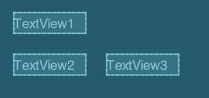
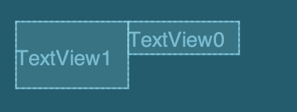
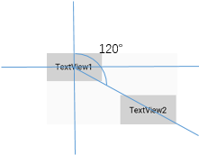

# ConstraintLayout 布局详解
> 约束布局ConstraintLayout 是一个ViewGroup,在API9之上皆可使用，它的出现主要是为了解决布局嵌套过多的问题。  

## 对比RelativeLayout
ConstraitLayout相对于RelativeLayout更加灵活，性能更出色。体现在ConstraintLayout可以按照比例约束控件位置和尺寸。  

## 添加依赖
gradle引入 `implementation 'androidx.constraintlayout:constraintlayout:1.1.3'`  

## 相对定位  


 如图中，`TextView2` 在 `TextView1`的下边，`TextView3` 在 `TextView2`的右边，在Code中如：  
```Java
<TextView
        android:id="@+id/tv1"
        android:layout_width="wrap_content"
        android:layout_height="wrap_content"
        android:layout_marginLeft="20dp"
        android:layout_marginTop="20dp"
        android:text="TextView1"
        app:layout_constraintLeft_toLeftOf="parent"
        app:layout_constraintTop_toTopOf="parent" />
    <TextView
        android:id="@+id/tv2"
        android:layout_width="wrap_content"
        android:layout_height="wrap_content"
        android:layout_marginLeft="20dp"
        android:layout_marginTop="20dp"
        android:text="TextView2"
        app:layout_constraintLeft_toLeftOf="parent"
        app:layout_constraintTop_toBottomOf="@id/tv1" />
    <TextView
        android:id="@+id/tv3"
        android:layout_width="wrap_content"
        android:layout_height="wrap_content"
        android:layout_marginLeft="20dp"
        android:text="TextView3"
        app:layout_constraintLeft_toRightOf="@id/tv2"
        app:layout_constraintTop_toTopOf="@id/tv2" />
```
其中的 `TextView3`中有 `layout_constraintLeft_toRightOf`属性，意为： 将`TextView3`的左边约束到`TextView2`的右边。其他的同理。

ConstraintLayout的相对定位用法和RelativeLaout的类似。

常用的相对定位布局属性有：
```Java
layout_constraintLeft_toLeftOf
layout_constraintLeft_toRightOf

layout_constraintRight_toLeftOf
layout_constraintRight_toRightOf

layout_constraintStart_toEndOf
layout_constraintStart_toStartOf

layout_constraintEnd_toEndOf
layout_constraintEnd_toStartOf

layout_constraintTop_toBottomOf
layout_constraintTop_toTopOf

layout_constraintBottom_toBottomOf
layout_constraintBottom_toTopOf


layout_constraintBaseline_toBaselineOf
```

关于`layout_constraintBaseline_toBaselineOf`(指的是文本的基线)用法：  


如图中的`TextView0` 与 `TextView1`高度不一致，但是希望文本可以对齐：  
```Java
<TextView
        android:id="@+id/tv0"
        android:layout_width="wrap_content"
        android:layout_height="wrap_content"
        android:text="TextView0"

        app:layout_constraintBaseline_toBaselineOf="@id/tv1"

        app:layout_constraintLeft_toRightOf="@id/tv1"
        app:layout_constraintTop_toTopOf="@id/tv1" />

    <TextView
        android:id="@+id/tv1"
        android:layout_width="wrap_content"
        android:layout_height="40dp"
        android:layout_marginLeft="20dp"
        android:layout_marginTop="20dp"
        android:gravity="center"
        android:text="TextView1"
        app:layout_constraintLeft_toLeftOf="parent"
        app:layout_constraintTop_toTopOf="parent" />
```

## 角度定位
> 角度定位是指可以用一个角度和一个距离来约束两个控件的中心。 
 
  
（图片来源于网络）
```Java
<TextView
        android:id="@+id/tv3"
        android:layout_width="wrap_content"
        android:layout_height="wrap_content"
        android:layout_marginLeft="20dp"
        android:text="TextView3"
        app:layout_constraintLeft_toRightOf="@id/tv2"
        app:layout_constraintTop_toTopOf="@id/tv2" />


    <TextView
        android:id="@+id/tv4"
        android:layout_width="wrap_content"
        android:layout_height="wrap_content"
        android:text="TextView4"
        app:layout_constraintCircle="@id/tv3"
        app:layout_constraintCircleAngle="120"
        app:layout_constraintCircleRadius="150dp" />
```

上面的`TextView4`使用了属性：  
`layout_constraintCircle`: 表示以哪个控件为中心  
`layout_constraintCircleAngle`: 表示 `TextView3`控件的 多少角度 方向  
`layout_constraintCircleRadius`: 表示 距离`TextView3`控件多远  


##  边距
> ConstraintLayout的margin，必须先约束该控件的位置，否则margin将会无效。

goneMargin主要用于约束的控件可见性被设置为gone时，被约束的控件（也就是使用goneMargin属性）使用的margin值有效。goneMargin属性如下：  
```Java
layout_goneMarginBottom
layout_goneMarginStart 
layout_goneMarginEnd 
layout_goneMarginLeft 
layout_goneMarginTop 
layout_goneMarginRight 
```

## 居中
ConstraintLayout的居中：
```
app:layout_constraintBottom_toBottomOf="parent"
app:layout_constraintLeft_toLeftOf="parent"
app:layout_constraintRight_toRightOf="parent"
app:layout_constraintTop_toTopOf="parent"
```

水平居中：
```
app:layout_constraintLeft_toLeftOf="parent"
app:layout_constraintRight_toRightOf="parent"
```

垂直居中：
```
app:layout_constraintBottom_toBottomOf="parent"
app:layout_constraintTop_toTopOf="parent"
```

## 偏移
> 一种是上面的margin属性使用  
> 一种是 垂直偏移：`app:layout_constraintVertical_bias="value"`和水平偏移：`app:layout_constraintHorizontal_bias="value"` （value 取值范围在 0-1）

## 尺寸约束


https://juejin.im/post/5bac92f2f265da0aba70c1bf#heading-6


